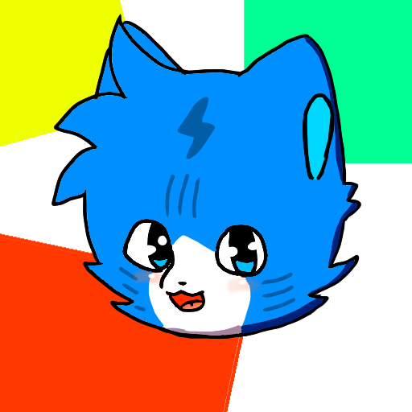

# Friday Night Funkin' Vs Bloodiey

## About

Bloodiey is a cat with a secret power hiding behind his cute face want to know it? play it now!

this mod adds a cat that could be cute but this cat has a huge power where actually can destroy everything if he wants.

but he doesn't want that obviously.

this is an old reimagination from my old mod.
<https://www.mediafire.com/file/f1bacidsa7hrwd6/mod_shido_xd.rar/file>

also, you have to install haxeflixel v 4.2.5.

After installation run setup.bat This will do the things for you automatically
NOTE: The first step is to take care of the windows, it will ask you some things.

or else Visit the official psych engine website.

<https://github.com/ShadowMario/FNF-PsychEngine>

You Can modify this mod inside <code>example_mods</code> all the files are in the root directory of the mods

Some of the FlashFiles are located in <code>art/flashFiles</code> with the fnf ones.

If there are some things that are "incorrect" Before making a Tweet Exposing me please notify
me for further modifications, adjustments, and censorship

## Avoid

Please Avoid using my characters without my permission, NSFW can be made since I can't control that side of the internet But when you are creating a mod You must ask before use And I Should approve the sprites (I'm Not Strict So Maybe you can publish it)

Do Not Use My character With Offensive/Controversial Intents (You will be exposed)

Memes are allowed only if they are not Controversial

## Be Aware!

Since I have Autism Some things that I can do Can be a little bit offensive but I don't notice that, You should Contact me before Exposing me on Twitter (This Will be used against you if you expose me)

## Discleamer

Nothing of this is related to real events This is only for entertainment

## Ideas

If you have any suggestions you can contact me

TYSM For Reading all of this

